# LPCC-Net: Local point cloud completion network for 3D object detection

## Introduction

This repository contains the pytorch implementation of **LPCC-NET** introducted in ICME21 paper **"LPCC-NET: RGB GUIDED LOCAL POINT CLOUD COMPLETION FOR OUTDOOR 3D OBJECT DETECTION."** From which, we propose an RGB-guided local point cloud completion network, that aims to improve off-the-shelf 3D object detectors by selectively densifying the collected point clouds.And our proposed method directly predicts the existence of points in 3D space around input points. 
Also, we create a semi-dense labeled local points completion dataset and design a new loss for training the network in a semi-supervised manner. Extensive experiments show that the proposed method can produce reasonable and accurate dense 3D point clouds from sparse inputs, improving off-the-shelf 3D object detectors on the KITTI 3D detection benchmark.

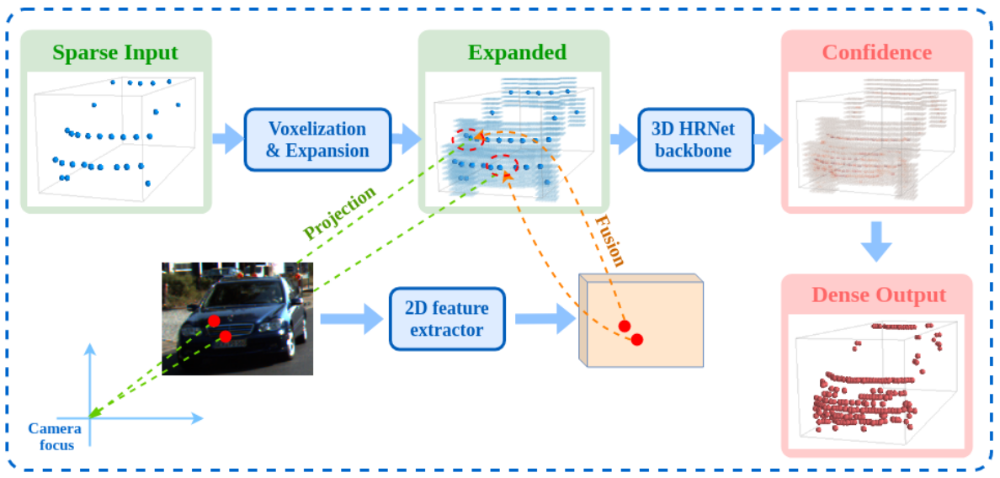

## Overview of our proposed pipeline

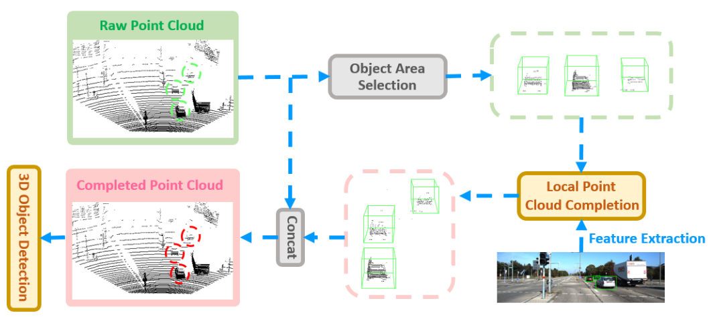

## Generate Sparse Sample

Here, Generating a sparse sample from a semi-dense raw point cloud. The raw point cloud is projected into spherical
coordinates. We randomly sample equidistant rows of scan lines and project them back to the Cartesian space.
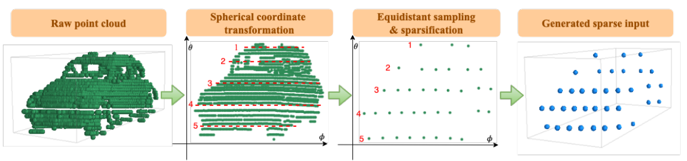

## Projection and grouping

Projection and grouping of voxels in the semi-dense labeled focal loss. Voxels that are projected to the same pixel belong to the same group.
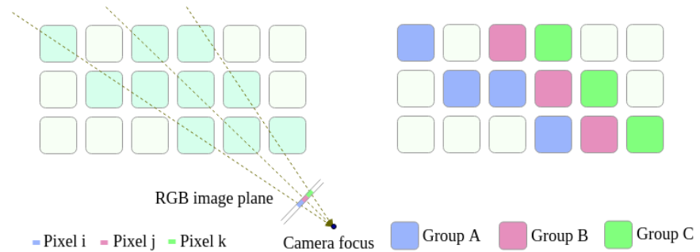

## Loss Function for Completion

We propose two loss functions to semi-supervise the network.

- ### Semi-dense labeled focal loss  
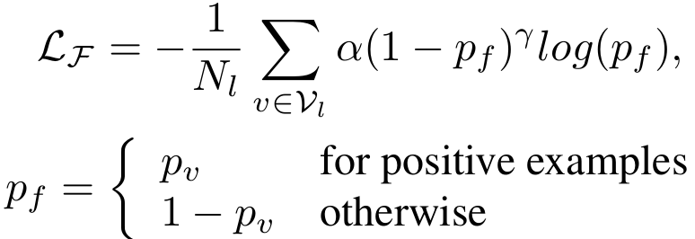


- ### Perspective projection constraint loss
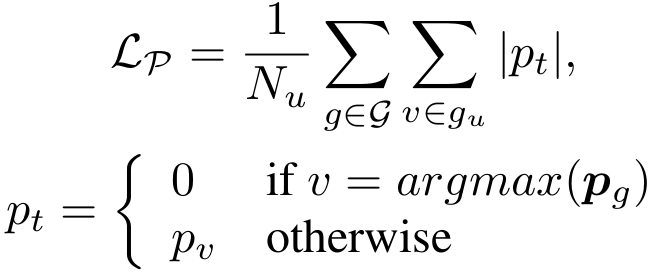

- ### Joint optimization    
The Total loss function in our work is as follows:

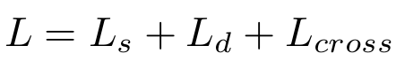

## Evaluation Results

- ### Improved 3D AP (%) of off-the-shelf 3D object detectors on KITTI 3D detection’s val
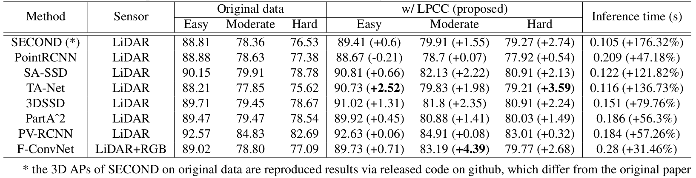

- ### Comparison with depth completion methods on KITTI 3D detection’s val
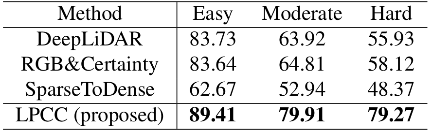

- ### Quantitive comparison of the completion quality
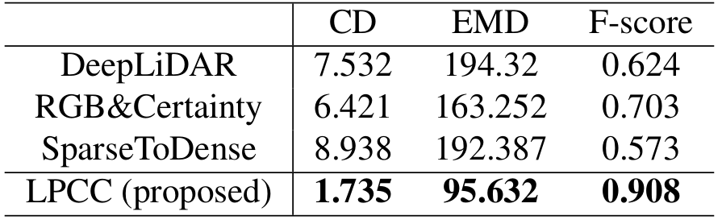

- ### Effectiveness of RGB and LiDAR information
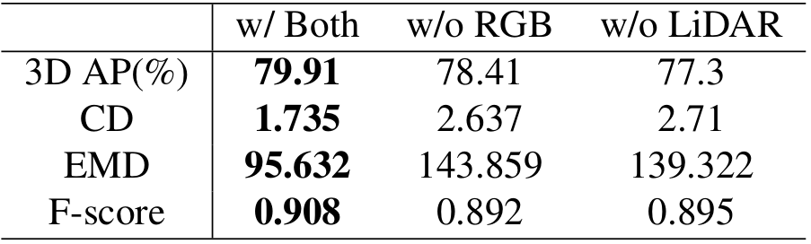

## Visualization

- Visual illustration of our completion results on the validation set of the created completion dataset. The blue shade in the second column represents the expanded area.

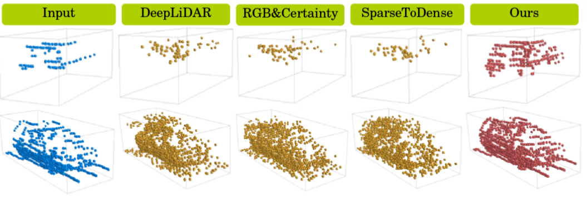

- Qualitative comparison between the depth completion methods and our proposed method.

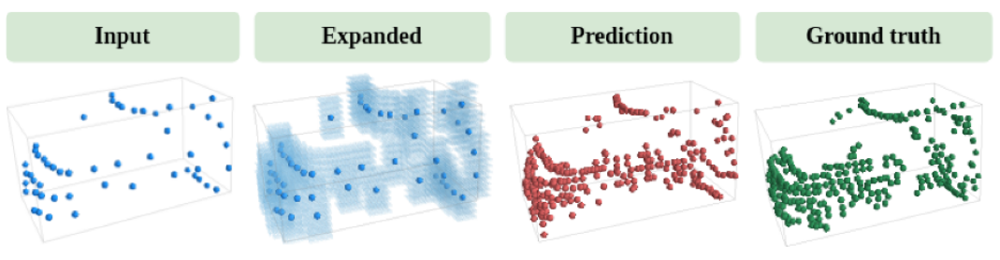

## Citation
Please cite the following reference if you feel our work is useful to your research.
```
@inproceedings{LPCC-NET_2021_ICME,
  author = {Yufei Wei and Yao Xiao and Yibo Guo and Shichao Liu and Lin Xu},
  title = {LPCC-NET: RGB GUIDED LOCAL POINT CLOUD COMPLETION FOR OUTDOOR 3D OBJECT DETECTION},
  booktitle = {The IEEE International Conference on Multimedia & Expo (ICME)},
  year  = {2021},
}
```

## Contact

For any question, please file an issue or contact

```
Yufei Wei (Shanghai Em-Data Technology Co., Ltd.) yufei.wei@gmail.com
Yao Xiao (Shanghai Em-Data Technology Co., Ltd.) xiaoyao@em-data.com.cn
Yibo Guo (Shanghai Em-Data Technology Co., Ltd.) guoyibo@em-data.com.cn
Shichao Liu (Shanghai Em-Data Technology Co., Ltd.) shichao.liu@gmail.com
Lin Xu (Shanghai Em-Data Technology Co., Ltd.) lin.xu5470@gmail.com
```
